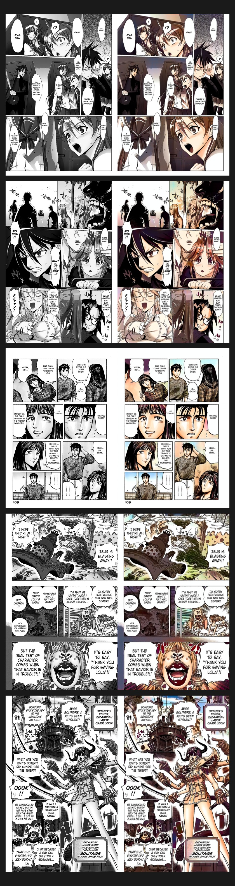

# Automatic Manga Colorization with Pix2Pix & LAB Color Space



*Left: Input Black & White | Right: Colorized Output*

*The gallery demonstrates the model's versatility across various manga styles, including Shonen (Action), Shojo (Romance), and Seinen (Detailed/Mature), handling different line weights and shading techniques effectively.*

An end-to-end deep learning system for automatically colorizing black-and-white manga pages. This project leverages a **Conditional Generative Adversarial Network (cGAN)** based on the **Pix2Pix** framework, enhanced with a **LAB color space formulation** to produce vibrant, structurally accurate colorizations.

## 🎨 Overview

Traditional image colorization often suffers from "muddy" or desaturated colors when using standard RGB models. This project addresses this by decoupling **Luminance (L)** from **Chrominance (AB)**:
*   **L-Channel (Structure):** Preserved exactly from the input black-and-white image.
*   **AB-Channels (Color):** Predicted by the Generator.

This ensures that the fine line art of the manga is never blurred or distorted, while the model focuses purely on "coloring between the lines."

## ✨ Key Features

*   **High-Quality Colorization:** Generates plausible colors for characters, clothes, and backgrounds.
*   **LAB Color Space:** Prevents structural artifacts and ensures sharp line art.
*   **Smart Tiling:** Handles high-resolution manga pages by processing them in overlapping tiles to preserve detail (configurable).
*   **Interactive Demo:** Includes a user-friendly Gradio web interface (`app.py`).

## 🚀 Installation

1.  **Clone the repository**:
    ```bash
    git clone https://github.com/yourusername/manga-colorization.git
    cd manga-colorization
    ```

2.  **Install dependencies**:
    Recommended to use a virtual environment (Python 3.10+).
    ```bash
    pip install -r requirements.txt
    ```

    *Note: Training requires a CUDA-capable GPU. Inference can run on CPU, but GPU is recommended.*

## 🎮 Usage

### Running the Demo (Inference)
Launch the interactive web interface to colorize your own images:

```bash
python app.py
```
Open the provided local URL (usually `http://127.0.0.1:7860`) in your browser.

### Training Your Own Model
If you have a paired dataset (B/W and Color images), you can train the model:

1.  **Prepare Data:** specificy your dataset paths in `train.py`:
    ```python
    MANGA_SKETCH_DIR = "path/to/bw"
    MANGA_COLOR_DIR = "path/to/color"
    ```
2.  **Start Training:**
    ```bash
    python train.py
    ```

## 🧠 Technical Details

*   **Generator:** U-Net Architecture with skip connections.
*   **Discriminator:** PatchGAN (70x70 receptive field).
*   **Loss Function:**
    *   Adversarial Loss (GAN)
    *   L1 Reconstruction Loss (Pixel accuracy)
    *   **Perceptual Loss (VGG19):** Ensures semantic consistency.
    *   **Chroma Loss:** Custom loss to encourage vivid saturation.

## 📊 Comparison: RGB vs LAB


*Comparison showing how the LAB formulation avoids the "color bleeding" and muddy artifacts common in direct RGB prediction.*

## 📝 License

This project is open-source. Please feel free to use and modify it for your own learning and experiments.
